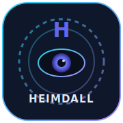
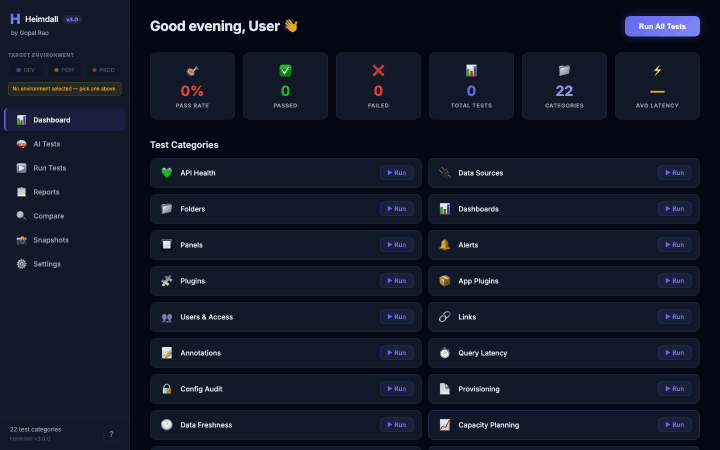
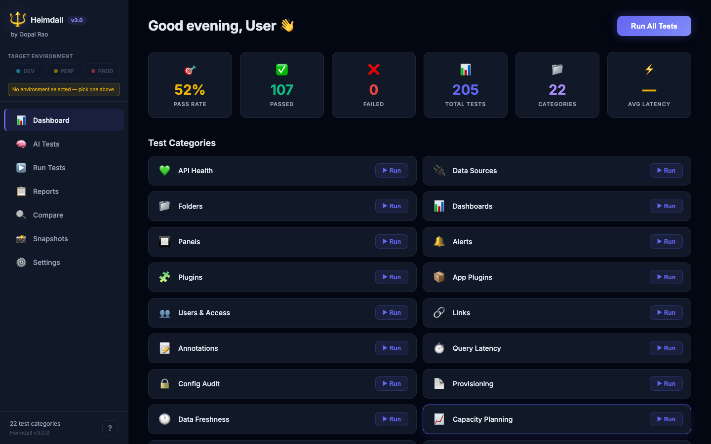
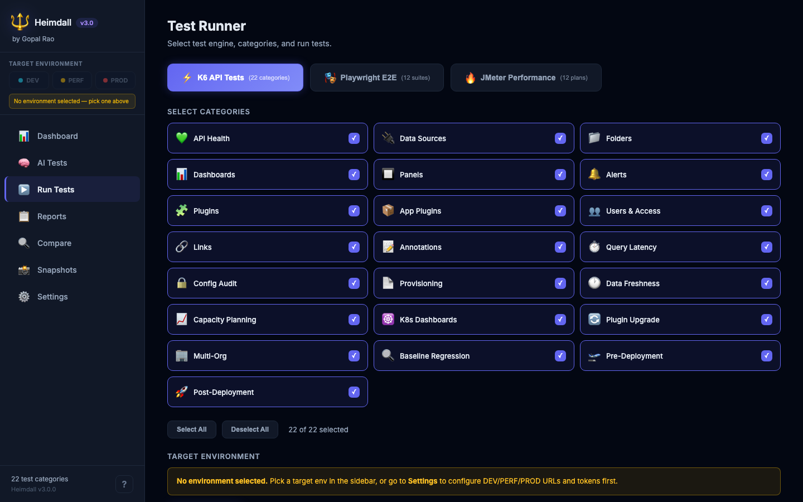
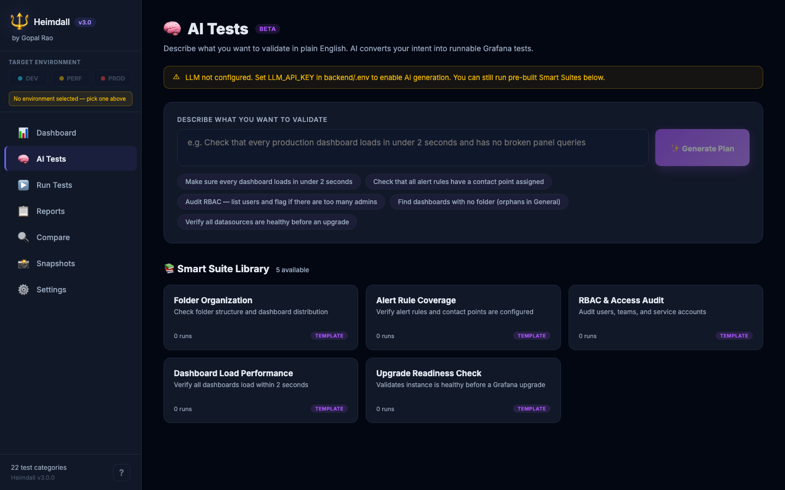
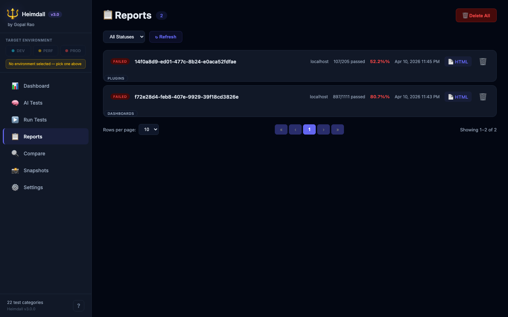
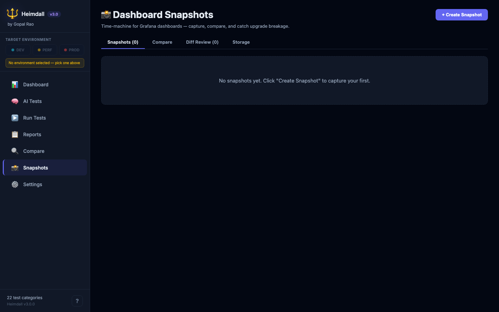
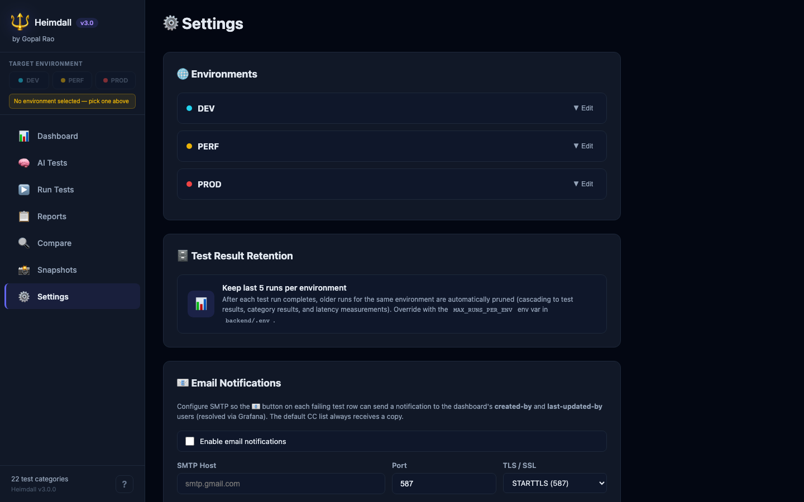
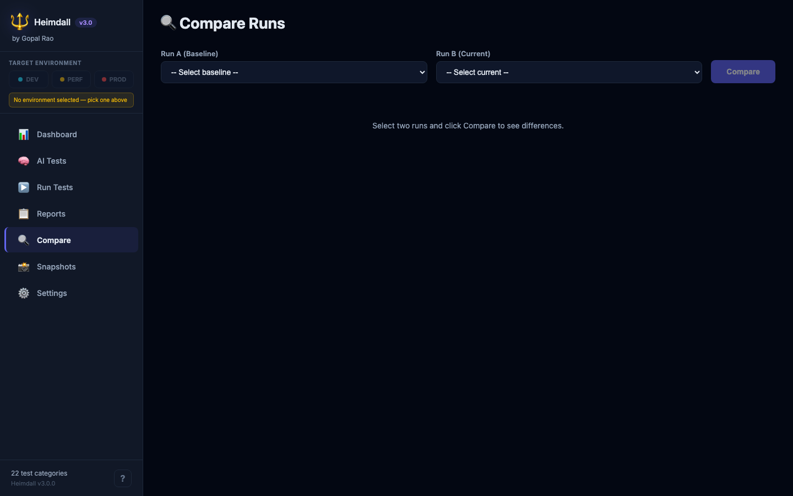

<p align="center">
  
</p>

<h1 align="center">Heimdall</h1>

<p align="center"><em>One platform. Three engines. Every layer of your Grafana stack.<br>K6 API tests · Playwright E2E · JMeter performance — plus AI-generated test suites, failure analysis, and a dependency graph.</em></p>

<p align="center">
  <a href="LICENSE"></a>
  =18">
  
  
  
  
  
  
</p>

<p align="center">
  <a href="#-quick-start">Demo</a> ·
  <a href="docs/getting-started/installation.md">Docs</a> ·
  <a href="docs/api/rest-reference.md">API Reference</a> ·
  <a href="CHANGELOG.md">Changelog</a> ·
  <a href=".github/ISSUE_TEMPLATE/bug_report.md">Report Bug</a>
</p>

---

<p align="center">
  
</p>

---

## 🤔 Why Heimdall?

Grafana is the default observability UI for most infrastructure teams — but **upgrades, plugin updates, and silent config drift break dashboards in ways you only discover during an incident**. A renamed datasource breaks 40 panels. A schema version bump turns graph panels into empty rectangles. An alert rule loses its receiver. And nobody notices until the on-call engineer is staring at a blank screen at 3am.

**Before Heimdall**, you had three separate tools: K6 scripts for API load, Playwright specs for browser tests, JMeter JMX files for performance. Each with its own runner, its own results, its own CI wiring. And zero visibility into how they connect to each other or to the dashboards that actually matter.

**Heimdall unifies all three engines into one platform**: **K6 API tests** (22 categories of functional checks), **Playwright E2E** (12 real-browser suites), and **JMeter performance** (18 load plans) — all driven from one React UI, one set of credentials, one results database. Add **AI-generated test suites** on top (describe what you want to test in plain English, Claude or GPT writes a safe read-only test plan you can approve and run) and **AI-powered failure analysis** that explains every red badge in plain English.

Built for **SREs, Platform Engineers, and Grafana Admins** who run Grafana as critical infrastructure. If your org has more than 50 dashboards, more than one environment, or upgrades Grafana without a panic room on the calendar — this is for you.

---

## ✨ Key Features

| | |
|---|---|
| ⚡ **Three Engines, One Platform** | **K6 API** (22 categories) + **Playwright E2E** (12 suites) + **JMeter performance** (18 plans) — all in one UI, one results database |
| 🧠 **AI Test Generator** | Describe tests in plain English — Claude or GPT writes a safe, whitelisted test plan you review and run. Ships with 5 pre-built Smart Suite templates |
| 🤖 **AI Failure Analysis** | Every failing test gets an AI-explained root cause + suggested fix, right in the report |
| 🧪 **17 Test Categories** | Systematic functional coverage from API health to data freshness — not just smoke tests |
| 🎭 **Playwright E2E** | 12 real-browser suites: login, navigation, dashboard render, alerting UI, visual regression |
| 🔥 **JMeter Performance** | 18 load-test plans with live metrics: API stress, auth throughput, query pressure, capacity planning |
| 🔗 **Clickable Grafana Deep Links** | Every WARN/FAIL result links straight to the dashboard, panel, or alert rule that broke |
| 🗺️ **Dependency Graph** | Trace "if I upgrade this plugin, which 47 dashboards explode?" before you upgrade |
| 🌍 **Multi-Environment** | Switch between DEV / PERF / PROD with one click; each env has its own token |
| 🎯 **Scope by Datasource** | Test only the dashboards/alerts that reference a specific DS — perfect for exporter-upgrade blast-radius checks |
| 📸 **Panel-Level Screenshots** | Playwright auto-captures failing panels as gzipped PNGs, embedded inline in the HTML report |
| 📧 **Email Notifications** | One click to notify the dashboard's createdBy/updatedBy + default CC with SMTP + Grafana user lookup |
| ⚡ **Live Progress Stream** | WebSocket-driven real-time updates so you see tests fail as they happen |
| 🐳 **Docker & Podman Ready** | One command spins up a pre-seeded demo — no Grafana required to try it |
| ⏰ **Cron Scheduler** | Schedule recurring test runs and get notified when things break |
| 📋 **HTML + JSON Reports** | Standalone branded reports with 7-column layout, creator/updater columns, clickable deep links |
| 🔄 **CI/CD Integration** | Drop into GitHub Actions, GitLab CI, or Jenkins with a single curl command |

---

## ⚡ Three Engines. One Platform.

Most teams stitch together three separate tools for Grafana testing. Heimdall gives you all three under one roof with a shared results store, one set of credentials, and a unified Run Tests UI:

<table>
  <tr>
    <th width="33%" align="center">⚡ K6 API</th>
    <th width="33%" align="center">🎭 Playwright E2E</th>
    <th width="33%" align="center">🔥 JMeter Performance</th>
  </tr>
  <tr>
    <td align="center"><strong>22 categories</strong><br><sub>~7,000+ assertions</sub></td>
    <td align="center"><strong>12 suites</strong><br><sub>24 specs, real Chromium</sub></td>
    <td align="center"><strong>18 plans</strong><br><sub>core + scenario + stress</sub></td>
  </tr>
  <tr>
    <td>API health, datasources, dashboards, panels, alerts, plugins, folders, users, annotations, query latency, config audit, provisioning, data freshness, capacity planning, K8s dashboards, plugin upgrade, multi-org, baseline regression, pre-deploy, post-deploy, alert E2E, and more</td>
    <td>Smoke (login / nav / health), Dashboard E2E (load / variables / time picker), Panel rendering, Alerting (rules / contacts / policies), Plugins, Datasources, Admin (users / teams / settings), Explore, Visual regression, Web Vitals, Security, K8s</td>
    <td>API health load, auth stress, dashboard load, DS query stress, alert eval, plugin API, search perf, mixed workload, spike test, capacity planning, deployment check, K8s load, and more</td>
  </tr>
</table>

**All three engines** honor the same [Scope by Datasource](docs/features/dependency-graph.md) filter, the same [multi-env](docs/features/environments.md) selector, and land in the same unified Reports UI. Run them individually or mix and match in one test execution.

---

## 🧠 AI Test Suites — describe, approve, run

Beyond AI *failure analysis*, Heimdall ships with a full **AI Dynamic Test Generator** that turns natural-language prompts into executable test plans:

```
"Verify my Grafana is ready for an upgrade — check all datasources are
 healthy, no plugins are broken, admin stats look reasonable."
```

Claude or GPT converts this into a structured JSON test plan using a **whitelisted action vocabulary** (GET-only Grafana API calls, assertions, iterations). You review the plan, optionally edit the JSON, click **Approve & Run**, and get results explained by the same LLM. Save any plan as a reusable **Smart Suite** — 5 templates ship out of the box:

| Smart Suite | What it tests |
|---|---|
| 🚀 **Upgrade Readiness Check** | All DS healthy, plugins loaded, instance health endpoint responsive |
| 📊 **Dashboard Load Performance** | Every dashboard loads in under 2 seconds |
| 🔒 **RBAC & Access Audit** | Users, admin count, service accounts inventory |
| 🔔 **Alert Rule Coverage** | Rules defined, contact points configured, policies valid |
| 📁 **Folder Organization** | Dashboards organized into folders, not all in General |

See [AI Test Generator docs](docs/features/ai-analysis.md) for the full action vocabulary and safety model.

---

## 🆚 Why not just write a bash script?

| Feature | **Heimdall** | Bash scripts | Manual testing |
|---|:---:|:---:|:---:|
| 17 test categories out of the box | ✅ | ❌ | ❌ |
| Grafana 9.x – 12.x version handling | ✅ | ⚠️ brittle | ✅ |
| Dependency graph / impact analysis | ✅ | ❌ | ❌ |
| AI-explained failures with fix suggestions | ✅ | ❌ | ❌ |
| Historical runs + regression comparison | ✅ | ❌ | ❌ |
| Clickable Grafana deep links on every result | ✅ | ❌ | ✅ |
| Real-time progress for long runs | ✅ | ❌ | ❌ |
| Zero maintenance when Grafana API changes | ✅ | ❌ | N/A |

Bash scripts are easy to start, impossible to maintain, and silently rot. Heimdall is the maintained alternative.

---

## 📸 Screenshots

<table>
  <tr>
    <td align="center">
      
      <br><b>Dashboard</b>
      <br><sub>Overview of recent runs, pass rates, and trends</sub>
    </td>
    <td align="center">
      
      <br><b>Run Tests</b>
      <br><sub>Pick categories, env, and kick off a run</sub>
    </td>
    <td align="center">
      
      <br><b>Live Progress</b>
      <br><sub>WebSocket updates as tests execute</sub>
    </td>
  </tr>
  <tr>
    <td align="center">
      
      <br><b>AI Failure Analysis</b>
      <br><sub>Claude / GPT explains every failure</sub>
    </td>
    <td align="center">
      
      <br><b>Reports List</b>
      <br><sub>Every run persisted and searchable</sub>
    </td>
    <td align="center">
      
      <br><b>HTML Report</b>
      <br><sub>Standalone report with donut charts</sub>
    </td>
  </tr>
  <tr>
    <td align="center">
      
      <br><b>Dependency Graph</b>
      <br><sub>Impact analysis for datasources & plugins</sub>
    </td>
    <td align="center">
      
      <br><b>Multi-Environment Settings</b>
      <br><sub>DEV / PERF / PROD in one place</sub>
    </td>
    <td align="center">
      
      <br><b>Schedules</b>
      <br><sub>Cron-based recurring runs</sub>
    </td>
  </tr>
</table>

---

## 🏛️ Architecture

```
┌───────────────────────────────────────────────────────────────────┐
│                         Heimdall v2                           │
└───────────────────────────────────────────────────────────────────┘

    ┌──────────────┐      WebSocket + REST      ┌──────────────┐
    │   React UI   │ ◄────────────────────────► │   Express    │
    │    :3001     │                            │    :4000     │
    └──────────────┘                            └──────┬───────┘
                                                       │
                         ┌─────────────────────────────┼─────────────────────────┐
                         ▼                             ▼                         ▼
                 ┌───────────────┐             ┌──────────────┐          ┌──────────────┐
                 │  Test Engine  │             │    SQLite    │          │ AI Analysis  │
                 │  17 categories│             │  (sql.js)    │          │ OpenAI/Claude│
                 └───────┬───────┘             └──────────────┘          └──────────────┘
                         │
                         ▼
                 ┌───────────────┐
                 │  Grafana API  │
                 │  9.x  –  12.x │
                 └───────────────┘
```

The React UI talks to the Express API over REST for commands and over WebSocket for live progress. Every test run persists to SQLite for history and regression comparison; the Test Engine runs 17 category modules against the Grafana HTTP API and streams results back to the UI as they arrive.

---

## 🚀 Quick Start

### Option A — Docker Demo *(recommended, 60 seconds)*

```bash
git clone https://github.com/gpadidala/heimdall.git
cd heimdall
./demo-run.sh
```

Then open **<http://localhost:3001>** and click **Run Tests** — pick any engine tab (K6 API / Playwright E2E / JMeter) and go.

> 💡 **Tip:** The demo spins up a pre-configured Grafana instance with 7 sample dashboards — no need to connect your own Grafana to try Heimdall. Your first K6 run finishes in under 30 seconds. You'll also have **AI Tests** ready to go (add an LLM key in Settings) and the **dependency graph** populated from real data.

### Option B — Manual setup

<details>
<summary>Click to expand — 4 steps, ~3 minutes</summary>

**1. Clone and install the backend**

```bash
git clone https://github.com/gpadidala/heimdall.git
cd heimdall/backend
npm install
```

**2. Configure your Grafana connection**

```bash
cp ../.env.example .env
# Edit .env and set:
#   GRAFANA_URL=http://your-grafana.example.com
#   GRAFANA_API_TOKEN=glsa_xxxxxxxxxxxxxxxx
#   GRAFANA_ORG_ID=1
#   PORT=4000
```

**3. Start the backend**

```bash
npm run dev
# → Listening on http://localhost:4000
```

**4. Start the frontend** *(new terminal)*

```bash
cd frontend
npm install
npm start
# → Open http://localhost:3001
```

**Generating a Grafana service-account token:**
`Administration → Service Accounts → Add service account → Role: Admin → Add token → copy the glsa_... value`. Paste into `.env`.

</details>

---

## 🧪 The 17 Test Categories

| # | Category | What it tests |
|---|---|---|
| 1 | 💚 **API Health** | Connectivity, auth, /api/health latency, build info |
| 2 | 🔌 **Data Sources** | Health endpoint per DS, sample queries, config validation |
| 3 | 📁 **Folders** | Hierarchy, permissions, nested folder support |
| 4 | 📊 **Dashboards** | Load, panel count, DS references, schema version, owner metadata |
| 5 | 🔲 **Panels** | Type validity, deprecated types, library panel resolution |
| 6 | 🔔 **Alerts** | Rules, conditions, contact points, notification policies, mute timings |
| 7 | 🧩 **Plugins** | Signature checks, version drift, health per plugin |
| 8 | 📦 **App Plugins** | Installed apps, page routes, configuration |
| 9 | 👥 **Users & Access** | Org users, teams, service accounts, admin count |
| 10 | 🔗 **Links** | Dashboard internal links, external URLs, snapshot resolution |
| 11 | 📝 **Annotations** | Orphan annotations, integrity, dashboard-level vs. org-level |
| 12 | ⏱️ **Query Latency** | Live profiling of panel queries, slow-query detection |
| 13 | 🔒 **Config Audit** | Feature toggles, auth config, CORS, security settings |
| 14 | 📄 **Provisioning** | Provisioned vs. manual dashboards, drift detection |
| 15 | 🕐 **Data Freshness** | Stale-data detection, time-range validity |
| 16 | 📈 **Capacity Planning** | Dashboard count, panel density, load distribution |
| 17 | ☸️ **K8s Dashboards** | Kubernetes-specific dashboards, cluster/namespace variables |

---

## ⚙️ Configuration

<details>
<summary><code>backend/.env</code> — essential settings</summary>

```env
# ── Grafana connection ───────────────────────────────────────
GRAFANA_URL=http://grafana.example.com       # no trailing slash
GRAFANA_API_TOKEN=glsa_xxxxxxxxxxxxxxxxxxxxx # service-account token, Admin role
GRAFANA_ORG_ID=1                             # org the token belongs to

# ── Server ───────────────────────────────────────────────────
PORT=4000                                     # backend listen port
NODE_ENV=production

# ── Test retention ───────────────────────────────────────────
MAX_RUNS_PER_ENV=5                            # keep last N runs per env, older ones auto-pruned

# ── AI failure analysis (optional) ───────────────────────────
LLM_PROVIDER=openai                           # or: claude
LLM_API_KEY=sk-xxxxxxxxxxxxxxxxxxxx           # OpenAI or Anthropic API key
LLM_MODEL=gpt-4o-mini                         # or: claude-sonnet-4-20250514

# ── Notifications (optional) ─────────────────────────────────
SLACK_WEBHOOK_URL=
PAGERDUTY_ROUTING_KEY=

# ── Performance tuning ───────────────────────────────────────
QUERY_TIMEOUT_MS=15000
DASHBOARD_LOAD_TIMEOUT_MS=30000
```

See the full [Configuration Reference](docs/getting-started/configuration.md) for every supported key, including proxy/SSL settings for corporate networks.

</details>

---

## 📡 API Overview

```bash
# Health check
curl http://localhost:4000/api/health

# List all 17 test categories
curl http://localhost:4000/api/tests/categories

# Run the full suite against a Grafana instance
curl -X POST http://localhost:4000/api/tests/run \
  -H 'Content-Type: application/json' \
  -d '{"grafanaUrl":"http://grafana:3000","token":"glsa_xxx","envKey":"DEV"}'

# Run a single category
curl -X POST http://localhost:4000/api/tests/run-category/dashboards \
  -H 'Content-Type: application/json' \
  -d '{"grafanaUrl":"http://grafana:3000","token":"glsa_xxx"}'

# Impact analysis: which dashboards depend on this datasource?
curl http://localhost:4000/api/graph/impact/datasource/prometheus-uid
```

Full REST documentation: [docs/api/rest-reference.md](docs/api/rest-reference.md) · WebSocket events: [docs/api/websocket-events.md](docs/api/websocket-events.md).

---

## 🚢 Deployment

<p align="center">
  <a href="docs/deployment/docker.md"></a>
  &nbsp;
  <a href="docs/deployment/ci-cd.md"></a>
  &nbsp;
  <a href="docs/guides/upgrade-validation.md"></a>
</p>

- **Docker** — multi-stage Dockerfile, docker-compose with optional demo Grafana, corporate-proxy friendly
- **CI/CD** — drop-in examples for GitHub Actions, GitLab CI, Jenkins, with a fail-the-build threshold
- **Upgrade validation** — baseline before the upgrade, re-run after, compare results side-by-side

---

## 🗺️ Roadmap

- [x] **V2.0** — 17 K6 test categories, React UI, SQLite persistence, AI failure analysis, dependency graph
- [x] **V2.1** — **Playwright E2E** (12 suites) + **JMeter performance** (18 plans) — three engines unified
- [x] **V2.2** — **AI Dynamic Test Generator** with Smart Suites (conversational test creation in plain English)
- [x] **V2.3** — Dashboard Snapshot & Upgrade Diff (semantic diffing across snapshots)
- [x] **V2.4** — Scope by Datasource, SMTP email notifications, per-panel screenshots in reports
- [ ] **V2.5** — Cross-environment comparison + automatic drift detection
- [ ] **V2.6** — Visual dashboard regression testing (pixel diff between snapshots)
- [ ] **V2.7** — Slack / Teams / PagerDuty integrations for scheduled run alerts

Have a feature idea? [Open a feature request](.github/ISSUE_TEMPLATE/feature_request.md).

---

## 📚 Documentation

### Getting Started
- 📖 [Installation](docs/getting-started/installation.md)
- ⚡ [Quick Start](docs/getting-started/quick-start.md)
- ⚙️ [Configuration Reference](docs/getting-started/configuration.md)
- 🎬 [First Run Walkthrough](docs/getting-started/first-run.md)

### Features
- 🧪 [The 17 Test Categories — detailed reference](docs/features/test-categories.md)
- 🧠 [AI Failure Analysis](docs/features/ai-analysis.md)
- 🗺️ [Dependency Graph & Impact Analysis](docs/features/dependency-graph.md)
- 🌍 [Multi-Environment Support](docs/features/environments.md)

### API
- 📡 [REST API Reference](docs/api/rest-reference.md)
- 🔌 [WebSocket Events](docs/api/websocket-events.md)

### Deployment
- 🐳 [Docker & Docker Compose](docs/deployment/docker.md)
- 🔄 [CI/CD Integration](docs/deployment/ci-cd.md)

### Guides
- 🧪 [Grafana Upgrade Validation](docs/guides/upgrade-validation.md)
- 🧰 [Troubleshooting](docs/guides/troubleshooting.md)

---

## 🤝 Contributing

Pull requests are welcome. For major changes, please [open an issue](.github/ISSUE_TEMPLATE/feature_request.md) first to discuss the design.

**Quick workflow:**

1. **Found a bug?** — file a [bug report](.github/ISSUE_TEMPLATE/bug_report.md) with reproduction steps and your Grafana version
2. **Want to add a test category?** — see the template in `backend/src/tests/` and open a PR
3. **Fixing something?** — fork, branch, test, and open a PR against `main`

Local development, code style, commit conventions, and the test harness are documented in [CONTRIBUTING.md](CONTRIBUTING.md).

---

## 🧱 Tech Stack

<p align="center">
  
  
  
  
  
  
  
  
  
</p>

---

## 🙏 Acknowledgments

Built for the Grafana community — and for every on-call engineer who's ever stared at a broken dashboard at 3am wondering which upgrade caused it. Special thanks to the teams behind the libraries that make Heimdall possible:

**[React](https://react.dev)** · **[Express](https://expressjs.com)** · **[sql.js](https://sql.js.org)** · **[Socket.IO](https://socket.io)** · **[Axios](https://axios-http.com)** · **[Playwright](https://playwright.dev)** · **[Recharts](https://recharts.org)** · **[Nodemailer](https://nodemailer.com)**

And to the [Grafana Labs](https://grafana.com) team for building the platform this project exists to protect.

---

## 📜 License & Author

**License:** [MIT](LICENSE) — free for commercial and personal use.

**Author:** **Gopal Rao** — Platform engineer building the AIOps toolkit.

<p align="center">
  <a href="https://github.com/gpadidala"></a>
  <a href="https://linkedin.com/in/gpadidala"></a>
  <a href="mailto:gopalpadiala@gmail.com"></a>
</p>

Copyright © 2026 Gopal Rao.

---

<p align="center">
  ⭐ <b>If Heimdall helps you, please star the repo — it helps others discover it.</b>
</p>

<p align="center">
  Built with ❤️ by <a href="https://github.com/gpadidala">Gopal Rao</a>
</p>
